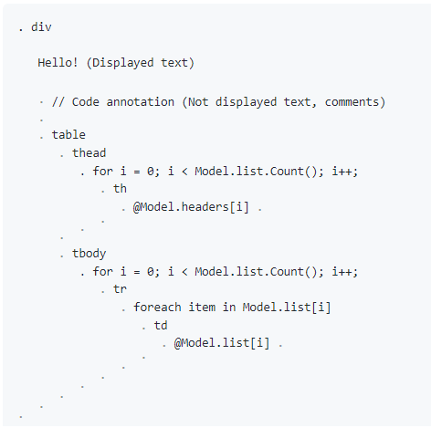

# Life without tags and brackets

Tags and brackets are commonly used to refer to programming language constructs, and today they represent a significant part of the source code.
The exceptions are those languages that use indentation to denote constructs. But using indentation for this purpose has the disadvantage of making the code too sparse.

But life without parentheses is possible even in C++, Java, C# and other languages. Even in such strict and concise languages, you can improve the readability of the text.
This moot point is not yet ready to be resolved for C++, but it is quite solvable for languages with tags.


Example markup:


```
<div>
    Hello
    <table>
        <thead>
            @for (int i = 0; i < headers.Count(); i++)
            {
                <th>@headers[i]</th>
            }
        </thead>
        <tbody>
            @for (int i = 0; i < Model.list.Count(); i++)
            {
                <tr>
                    @foreach (var item in Model.list[i])
                    {
                        <td>@Model.list[i]</td>
                    }
                </tr>
            }
        </tbody>
    </table>
</div>
```

For the markup of the above example, it is suggested SIATM markup:



(The dots represent block boundaries and can be replaced with color scheme)

As text markup built on a binary basis, it has many more features than HTML, including the composition of high-level components and graphical representations of markup blocks.
And this is just one DSL out of many possible in document.
